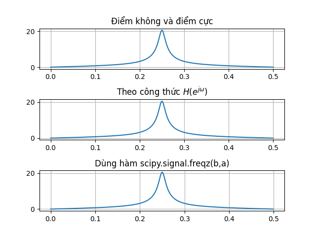

# Magtitude Response
> Trần Công Minh 
- Vẽ đáp ứng biên độ theo 3 cách

```python
# Magtitude Response
import matplotlib.pyplot as plt
import numpy as np
from scipy.signal import freqz
plt.rcParams['axes.grid'] = True

fig, axs = plt.subplots(3)
plt.subplots_adjust(hspace=0.75)
w = np.linspace(0,np.pi,1000)
f = w/(2*np.pi)
TS = np.sqrt((np.cos(w)+1)**2 + (np.sin(w))**2) * np.sqrt((np.cos(w)-1)**2 + (np.sin(w))**2)
MS = np.sqrt((np.cos(w))**2 + (np.sin(w)+0.95)**2) * np.sqrt((np.cos(w))**2 + (np.sin(w)-0.95)**2)
H1 = TS/MS
axs[0].plot(f,H1)
axs[0].set_title('Điểm không và điểm cực')

#----------------------------------------------------------------
z1 = 1
z2 = -1
p1 = 1j*0.95
p2 = -1j*0.95
z = np.cos(w) + 1j*np.sin(w)
H2 = (z-z1)*(z-z2)/((z-p1)*(z-p2))
axs[1].plot(f,np.abs(H2))
axs[1].set_title('Theo công thức $H(e^{j\omega})$')

#----------------------------------------------------------------
a = [1,0,0.9025]
b = [1,0,-1]
w3, H3 = freqz(b,a)
f3 = w3/(2*np.pi)
axs[2].plot(f3,np.abs(H3))
axs[2].set_title('Dùng hàm scipy.signal.freqz(b,a)')
plt.show()
```
