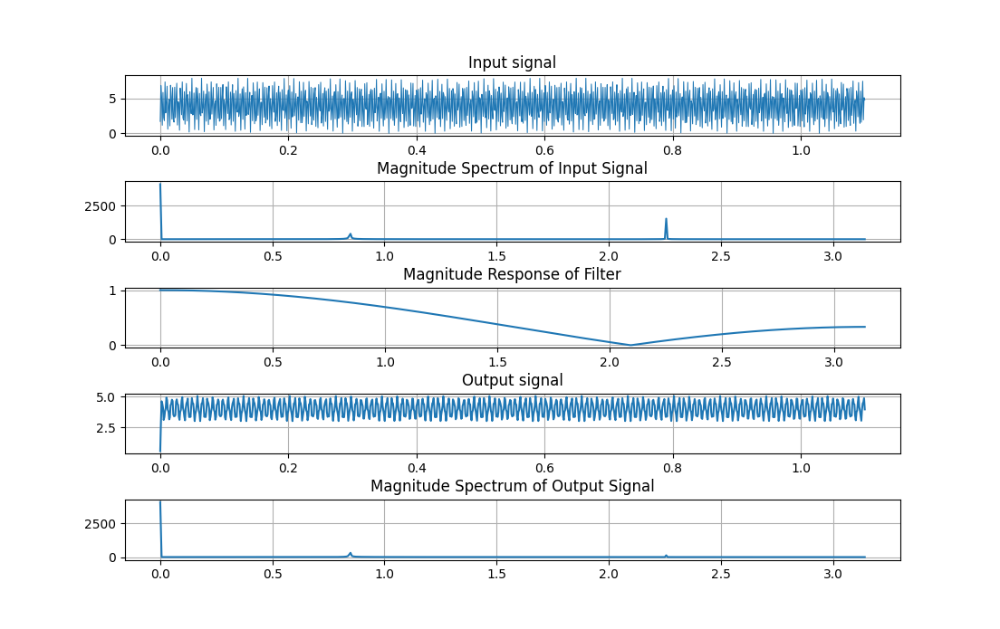

# Code Tuần 10
> Trần Công Minh - 20200413
```python
from scipy.signal import freqz  
from scipy import signal  
import numpy as np  
import matplotlib.pyplot as plt  
plt.rcParams['axes.grid'] = True  
  
fig, axs = plt.subplots(5)  
plt.subplots_adjust(hspace=0.75)  
  
N = 1024  
t = np.linspace(0,1.1,N)  
Fs = 1000  
n = t*Fs  
x = 4 + np.cos(250*np.pi*t - np.pi/4) - 3*np.cos((2000*np.pi)/3 * t)  
axs[0].plot(t,x,linewidth=0.75)  
axs[0].set_title('Input signal')  
  
# Tính phổ  
X = np.fft.fft(x, N)  
X.resize(512)  
w = np.linspace(0,np.pi,512)  
axs[1].plot(w,abs(X))  
axs[1].set_title('Magnitude Spectrum of Input Signal')  
  
b = [1,1,1]  
a = [3,0,0]  
w, H = freqz(b,a)  
f = w/(2*np.pi)  
axs[2].plot(w,abs(H))  
axs[2].set_title('Magnitude Response of Filter')  
  
y = signal.lfilter(b, a, x)  
axs[3].plot(t,y)  
# axs[3].set_ylim(3.1,5)  
axs[3].set_title('Output signal')  
  
Y = np.fft.fft(y, N)  
Y.resize(512)  
w = np.linspace(0,np.pi,512)  
axs[4].plot(w,abs(Y))  
axs[4].set_title('Magnitude Spectrum of Output Signal')  
plt.show()
```

Kết quả ta được hình như sau:

